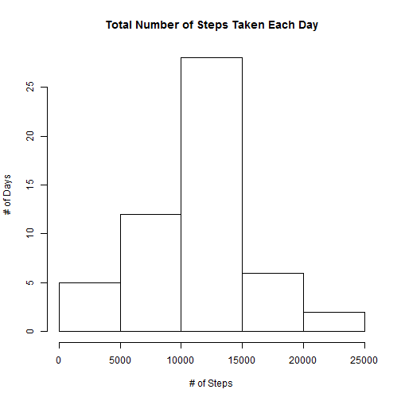
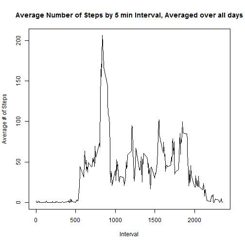
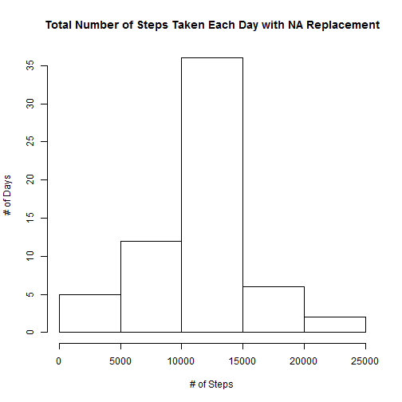
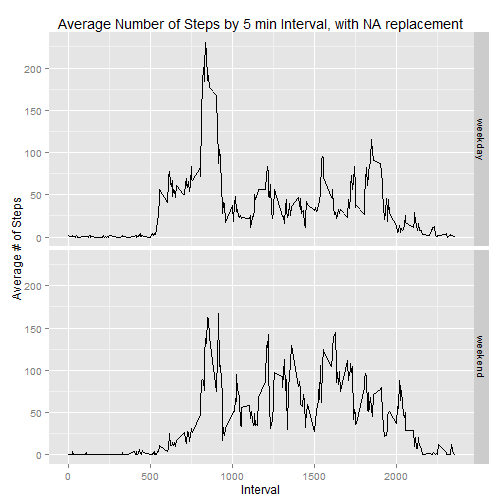

<<<<<<< HEAD
Reproducible Research - Homework #1
=======================================

## Loading and preprocessing the data

### Load the data


```r
temp <- tempfile()
setInternet2(use=TRUE)
download.file("https://d396qusza40orc.cloudfront.net/repdata%2Fdata%2Factivity.zip",temp,mode="wb")
data <- read.csv(unz(temp,"activity.csv"),header=TRUE, na.strings = "NA")
unlink(temp)
```

### Process/transform the data

Convert the 'date' from characters into POSIXct date format


```r
library(lubridate)
```

```
## Warning: package 'lubridate' was built under R version 3.1.3
```

```r
data$date <- ymd(data$date)
```

## What is mean total number of steps taken per day?

### Calculate the total number of steps taken per day


```r
library(plyr)
```

```
## 
## Attaching package: 'plyr'
## 
## The following object is masked from 'package:lubridate':
## 
##     here
```

```r
# Remove NA values
dat <- data[complete.cases(data),]
s_d <- ddply(dat,"date",summarise,sum=sum(steps))
```
### Display histogram of total steps per day

```r
hist(s_d$sum,xlab="# of Steps",ylab="# of Days",
     main="Total Number of Steps Taken Each Day")
```

 

### Calculate mean and median of total number of steps taken per day

```r
summary(s_d$sum)
```

```
##    Min. 1st Qu.  Median    Mean 3rd Qu.    Max. 
##      41    8841   10760   10770   13290   21190
```

## What is the average daily activity pattern?
### Display a time series plot of the 5-minute interval  and the average number of steps taken, averaged across all days


```r
# Find the average number of steps per interval across all days
s_m <- ddply(dat,"interval",summarise,avg=mean(steps))
plot(s_m,type="l",xlab="Interval",ylab="Average # of Steps",
     main="Average Number of Steps by 5 min Interval, Averaged over all days")
```

 

### Identify Which 5-minute interval contains the maximum number of steps


```r
s_m[which.max(s_m$avg),1]
```

```
## [1] 835
```
## Imputing missing values

### Calculate and report the total number of missing values in the dataset


```r
sum(is.na(data$steps))
```

```
## [1] 2304
```

### Replace all of the missing values in the dataset with the average for that 5-minute interval


```r
# Add interval average column to dataframe
dat2 <- join(data,s_m,by="interval")
dat2$steps[is.na(dat2$steps)] <- dat2$avg[is.na(dat2$steps)]
```

### Make a histogram of the total number of steps taken each day and Calculate and report the mean and median

```r
s_d2 <- ddply(dat2,"date",summarise,sum=sum(steps))
hist(s_d2$sum,xlab="# of Steps",ylab="# of Days",
     main="Total Number of Steps Taken Each Day with NA Replacement")
```

 

```r
summary(s_d2$sum)
```

```
##    Min. 1st Qu.  Median    Mean 3rd Qu.    Max. 
##      41    9819   10770   10770   12810   21190
```

Replacing the NAs with the interval average value caused the number of days with 10,000-15,000 steps to increase (25-35). The Mean was the same for both datasets, but the Median was larger when the NAs were replaced (rather than removed).

## Are there differences in activity patterns between weekdays and weekends?

### Create a new factor variable in the dataset with two levels - "weekday" and "weekend"


```r
dat2$Day <- weekdays(dat2$date)
dat2$Day[dat2$Day=="Monday"] <- "weekday"
dat2$Day[dat2$Day=="Tuesday"] <- "weekday"
dat2$Day[dat2$Day=="Wednesday"] <- "weekday"
dat2$Day[dat2$Day=="Thursday"] <- "weekday"
dat2$Day[dat2$Day=="Friday"] <- "weekday"
dat2$Day[dat2$Day=="Saturday"] <- "weekend"
dat2$Day[dat2$Day=="Sunday"] <- "weekend"
```

### Make a panel plot containing a time series plot of the 5-minute interval and the average number of steps taken, averaged across all weekday days or weekend days


```r
library(ggplot2)
s_m2 <- ddply(dat2,.(interval,Day),summarise,avg=mean(steps))
ggplot(s_m2,aes(interval,avg))+geom_line()+facet_grid(Day~.)+
  xlab("Interval")+ylab("Average # of Steps")+
  ggtitle("Average Number of Steps by 5 min Interval, with NA replacement")
```

 
